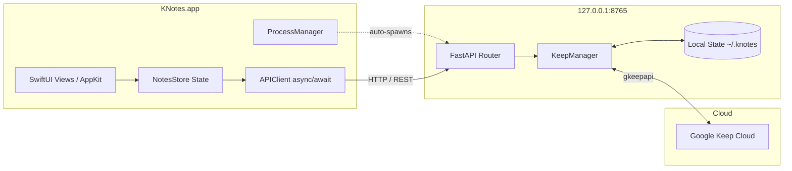

# KNotes 

> **Notes clone with Google Keep backend for macOS**  
> Built with native **Swift 6 / SwiftUI** and a high-performance local **gkeepapi** Python service.


---

## 🌟 Overview

**KNotes** brings the iconic, minimalist design language of **Notes** on macOS to **Google Keep**. It delivers an authentic Apple desktop experience—translucent sidebars, liquid glass vibrancy, native navigation split views, rich checklists, tag filtering, and Apple pastel color palettes—backed by bidirectional cloud synchronization with Google Keep via `gkeepapi`.

---

## ✨ Features

- **Iconic 3-Column macOS Interface**:
  - **Column 1 (Sidebar)**: Quick Notes, All Notes, Pinned, Archive, Recently Deleted, and custom Tags/Labels with live count badges.
  - **Column 2 (Notes List)**: Instant search (`⌘F`), grouped Pinned and Chronological sections, snippet previews, color indicators, and right-click context menus.
  - **Column 3 (Editor)**: Unified toolbar (`⌘N` for new note, `⇧⌘N` for new checklist, `⌘S` for sync), large typography, date subtitles, and rich formatting.
- **Interactive Checklists**: Checkboxes with smooth completion animations, item reordering, and collapsible completed sections.
- **Apple Pastel Color Themes**: Curated Google Keep color palette mapped to macOS vibrancy (White, Yellow, Green, Teal, Blue, Purple, Pink, Coral, Gray).
- **Dual-Mode Operation (Offline-First)**:
  - Works instantly out of the box with zero configuration in local mode.
  - Seamlessly connects to your Google Keep account when credentials are provided.
- **Bidirectional Cloud Sync**: Automatically syncs note creations, edits, pinned state, labels, and trash with Google Keep in the background.
- **Secure by Design**:
  - Bound strictly to localhost (`127.0.0.1:8765`, never `0.0.0.0`).
  - Restricted permissions (`0700` directory, `0600` session and state files).
  - PII masking and zero credential logging.

---

## 🏗️ Architecture



---

## 🚀 Installation & Running

### Option 1: Direct Launch (Pre-Installed)
KNotes is already compiled and installed in your system `/Applications` directory:
- Open Spotlight (`⌘Space`), type **KNotes**, and press **Enter**.
- Or run in Terminal:
  ```bash
  open /Applications/KNotes.app
  ```

### Option 2: Build and Install from Source
To rebuild the release binary and refresh the `/Applications/KNotes.app` bundle:
```bash
./scripts/build_and_install.sh
```

---

## 🔑 Connecting to Google Keep

1. Open KNotes and click the **Connection Status** at the bottom of the sidebar (or press `⌘,`).
2. Enter your Google account email (`@gmail.com`).
3. If 2-Step Verification is enabled on your Google account:
   - Go to [Google Account Security](https://myaccount.google.com/security).
   - Under *How you sign in to Google*, select **2-Step Verification** > **App passwords**.
   - Generate an App Password for **KNotes** and paste the 16-character password into KNotes.
4. Click **Connect Account**.
5. KNotes will authenticate, fetch your Google Keep notes, and maintain bidirectional sync!

---

## ⌨️ Keyboard Shortcuts

| Shortcut | Action |
|---|---|
| `⌘N` | Create New Note |
| `⇧⌘N` | Create New Checklist |
| `⌘F` | Search All Notes |
| `⌘S` | Sync with Google Keep |
| `⌘T` | New Tag / Label |
| `⌘,` | Google Keep Account Settings |
| `⌘⌫` | Move Selected Note to Trash |

---

## 🧪 Testing

### Backend Unit & Integration Tests
Run the automated test suite testing status, note CRUD, checklist reordering, tagging, and security directory permissions:
```bash
PYTHONPATH=backend ./.venv/bin/pytest backend/tests/test_api.py -v
```

### End-to-End Test Suite
Run the full workflow test runner:
```bash
python3 scripts/verify_e2e.py
```

---

## 📄 License
MIT License. Created by Madhuraj.
