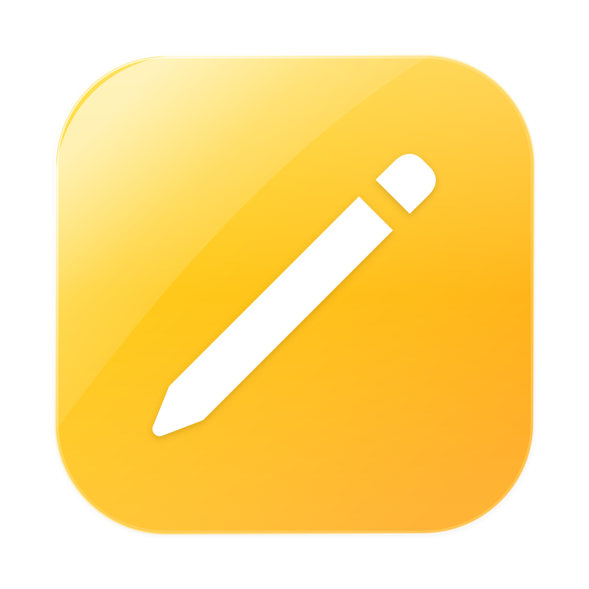

# kNotes

Fast, offline-first native macOS notes app for Google Keep. Built with Swift & SwiftUI.

<p align="center">
  
</p>

## Highlights

- **Native & Fluid**: 3-column layout, liquid glass materials, and dark mode.
- **Offline-First**: Instant local cache with background bidirectional Google Keep sync.
- **Rich Notes & Lists**: Checklists, tags, markdown preview, and color themes.
- **macOS Integrations**: CoreSpotlight search (`⌘ Space`), menu bar quick capture, CLI (`knotes`), and native Share Sheet.

---

## Installation

### Pre-built DMG
Download the latest disk image from [Releases](https://github.com/madhuraj0/knotes/releases) and drag **kNotes** to `/Applications`.

### Build from Source
Requirements: macOS 14.0+, Swift, Python 3.10+.

```bash
git clone https://github.com/madhuraj0/knotes.git
cd knotes
./scripts/build_and_install.sh
```

---

## Shortcuts

| Shortcut | Action |
|---|---|
| `⌘N` | New Note |
| `⇧⌘N` | New Checklist |
| `⌘F` | Search Notes |
| `⌘S` | Sync with Google Keep |
| `⌘T` | New Tag |
| `⌘1` – `⌘5` | Navigate Folders |
| `⌥↓` / `⌥↑` | Next / Previous Note |
| `⌘E` | Markdown Preview |
| `⇧⌘L` | Toggle Checklist |
| `⌥⌘P` | Pin Note |
| `⇧⌘A` | Archive Note |
| `⌃⌘C` | Change Color |
| `⌘,` | Settings |
| `⌘⌫` | Move to Trash |

---

## Attributions

Built on top of **[gkeepapi](https://github.com/kiwiz/gkeepapi)**, the open-source Google Keep API client created by **Kai (kiwiz)**.

---

## License

GNU General Public License v3.0 (GPLv3) © 2026 madhuraj0. See [LICENSE](LICENSE) for details.
